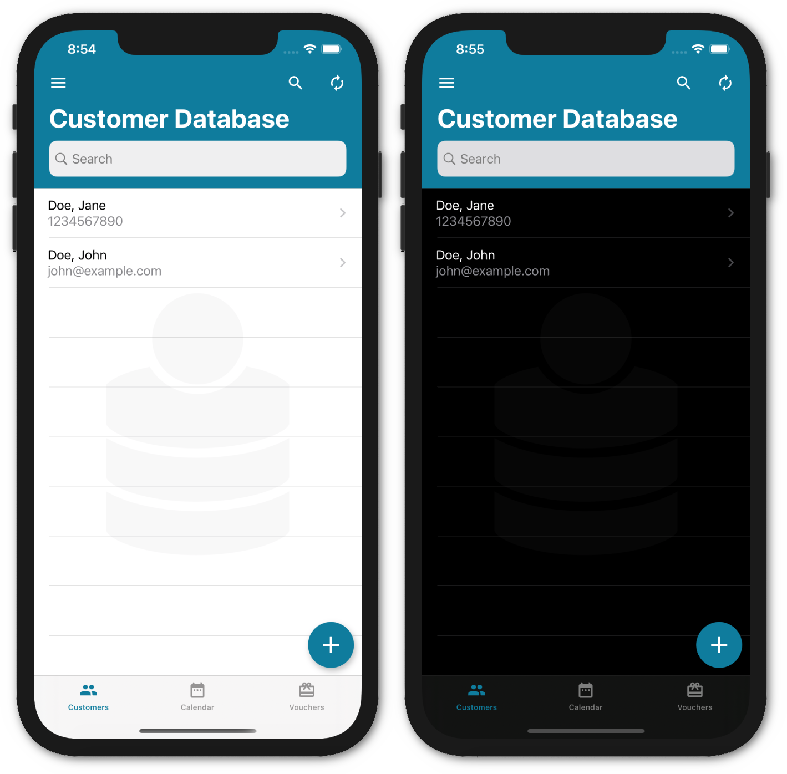

# Customer Database iOS

With this iOS app you can manage your customers separated from the private contacts, business appointments and vouchers. It is also available for [Android](https://github.com/schorschii/customerdb-android).

The goal of this project is to provide an easy-to-use, platform independent, open source CRM application for small businesses without tracking or forced cloud connection. To enable non-technical users to use the sync feature, a cloud service is provided optionally. If you like this project, please support the development by purchasing one of the in-app purchases in the App Store or via Github sponsoring.

You can set up your own self-hosted sync server using the [Customer Database Server](https://github.com/schorschii/customerdb-server), which is also open source.

Contributions welcome :-)

## Screenshots

